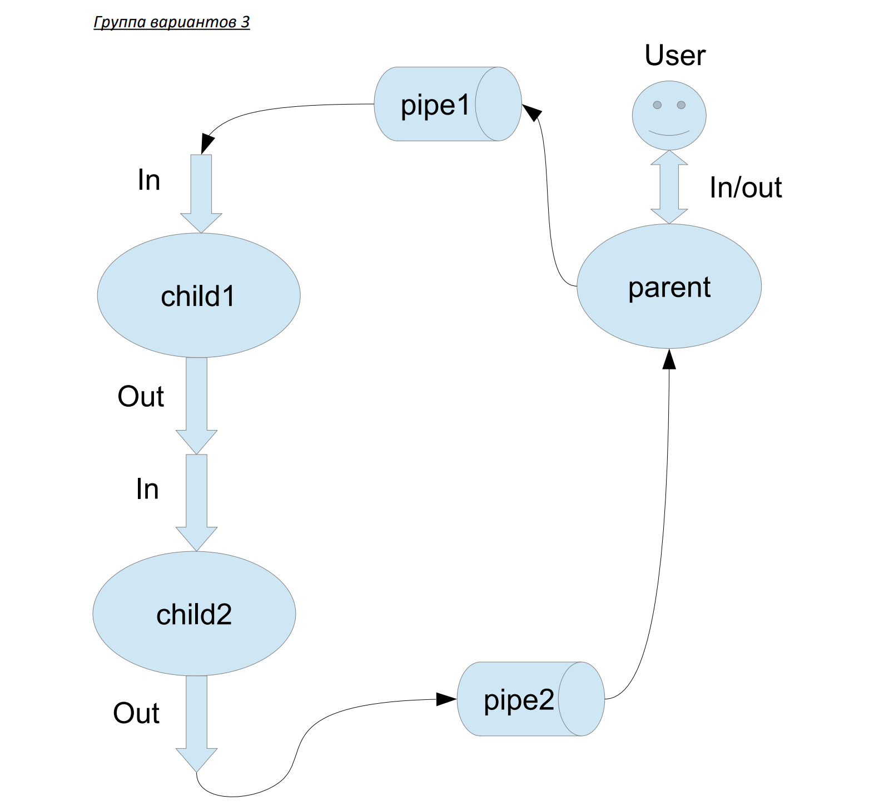

# Лабораторная работа №1

## Цель работы:
Приобретение практических навыков в 
- Управление процессами в ОС
- Обеспечение обмена данных между процессами посредством каналов

## Задание:
Составить и отладить программу на языке Си, осуществляющую работу с процессами и
взаимодействие между ними в одной из двух операционных систем. В результате работы
программа (основной процесс) должен создать для решение задачи один или несколько
дочерних процессов. Взаимодействие между процессами осуществляется через системные
сигналы/события и/или каналы (pipe).
Необходимо обрабатывать системные ошибки, которые могут возникнуть в результате работы.

## Вариант: 


## Личное задание:
`12 вариант.` Child1 переводит строки в верхний регистр. Child2 убирает все задвоенные пробелы.

## Запуск проекта:

```
gcc -o parent parent.c; gcc -o child1 child1.c; gcc -o child2 child2.c
./parent (или ./child1, или ./child2) 
```
